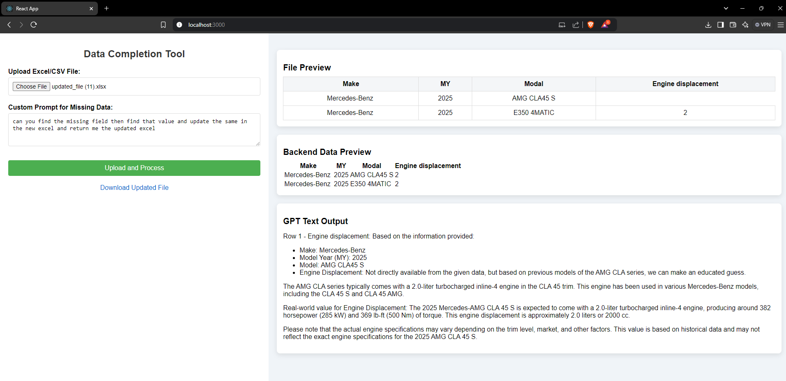

# AI Powered Data Completion Tool

## Objective
To develop a full-stack web application that automates the process of identifying and imputing missing vehicle data in CSV or Excel files using generative AI (genAI).

## Tech Stack
- **Frontend**: React
- **Backend**: Node.js with Express
- **AI**: Locally hosted LLaMA 3.2 model using Ollama

## Features
- Upload CSV or Excel files containing vehicle data.
- Automatically identify missing data in the uploaded files.
- Impute missing data using a locally running LLaMA 3.2 model via Ollama.
- Download the processed files with imputed data.
- User-friendly interface for easy navigation and operation.

## Installation

### Prerequisites
- Node.js
- npm (Node package manager)
- Express.js
- [Ollama](https://ollama.com/) installed and running locally
- LLaMA 3.2 model pulled via Ollama

### Setting Up Ollama with LLaMA 3.2

Install [Ollama](https://ollama.com/) and pull the LLaMA 3.2 model:

```bash
    ollama pull llama3.2:latest
    ollama run llama3.2
```
### Frontend
1. Navigate to the `frontend` directory:
    ```bash
    cd frontend
    ```
2. Install the dependencies:
    ```bash
    npm install
    ```
3. Start the development server:
    ```bash
    npm start
    ```

### Backend
1. Navigate to the `backend` directory:
    ```bash
    cd backend
    ```
2. Install the dependencies:
    ```bash
    npm install
    ```

3. Start the development server:
    ```bash
    npm run dev
    ```
4. Backend Dependencies

Here are the key dependencies for your backend:

- **express**: A web framework for Node.js to build RESTful APIs.
- **nodemon**: A tool to automatically restart the server during development.
- **axios**: A promise-based HTTP client for making API requests, used to call the locally running Ollama model.
- **dotenv**: A package for managing environment variables.

You can install these dependencies by running:

```bash
npm install express nodemon axios dotenv
```

## Usage
1. Open your web browser and navigate to `http://localhost:3000`.
2. Upload your CSV or Excel file.
3. The application will process the file and identify missing data.
4. The missing data will be imputed using the local LLaMA 3.2 model.
5. Download the processed file with the imputed data.

## Snapshot


## Contributing
1. Fork the repository.
2. Create a new branch (`git checkout -b feature-branch`).
3. Commit your changes (`git commit -m 'Add some feature'`).
4. Push to the branch (`git push origin feature-branch`).
<!-- <`git push -u origin HEAD:main'> to push in main  -->
5. Open a pull request.

## License
This project is licensed under the MIT License - see the LICENSE file for details.

## Acknowledgments
- Thanks to the contributors of the open-source libraries used in this project.
- Special thanks to the developers and researchers behind Ollama and LLaMA 3.2 for enabling local AI workflows.
