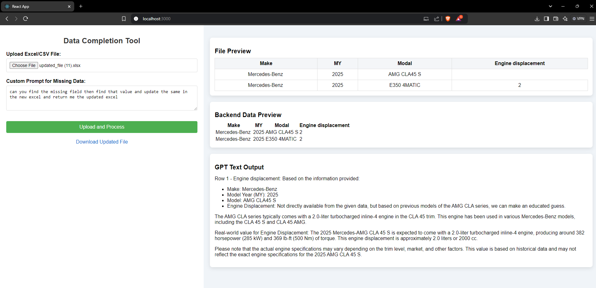

# AI Assistance for Vehicle Data Information Verification 

## Objective
To develop a full-stack web application that automates the process of identifying and imputing missing vehicle data in CSV or Excel files using generative AI (genAI).

## Tech Stack
- **Frontend**: React
- **Backend**: Python

## Features
- Upload CSV or Excel files containing vehicle data.
- Automatically identify missing data in the uploaded files.
- Impute missing data using generative AI models.
- Download the processed files with imputed data.
- User-friendly interface for easy navigation and operation.

## Installation

### Prerequisites
- Node.js
- Python 3.x
- pip (Python package installer)

### Frontend
1. Navigate to the `frontend` directory:
    ```bash
    cd frontend
    ```
2. Install the dependencies:
    ```bash
    npm install
    ```
3. Start the development server:
    ```bash
    npm start
    ```

### Backend
1. Navigate to the `backend` directory:
    ```bash
    cd backend
    ```
2. Create a virtual environment:
    ```bash
    python -m venv venv
    ```
3. Activate the virtual environment:
    - On Windows:
        ```bash
        venv\Scripts\activate
        ```
    - On macOS/Linux:
        ```bash
        source venv/bin/activate
        ```
4. Install the dependencies:
    ```bash
    pip install -r requirements.txt
    ```
5. Start the backend server:
    ```bash
    python app.py
    ```

## Usage
1. Open your web browser and navigate to `http://localhost:3000`.
2. Upload your CSV or Excel file.
3. The application will process the file and identify missing data.
4. The missing data will be imputed using generative AI.
5. Download the processed file with the imputed data.

## Snapshot


## Contributing
1. Fork the repository.
2. Create a new branch (`git checkout -b feature-branch`).
3. Commit your changes (`git commit -m 'Add some feature'`).
4. Push to the branch (`git push origin feature-branch`).
<!-- <`git push -u origin HEAD:main'> to push in main  -->
5. Open a pull request.

## License
This project is licensed under the MIT License - see the LICENSE file for details.

## Acknowledgments
- Thanks to the contributors of the open-source libraries used in this project.
- Special thanks to the developers and researchers who have contributed to the field of generative AI.
